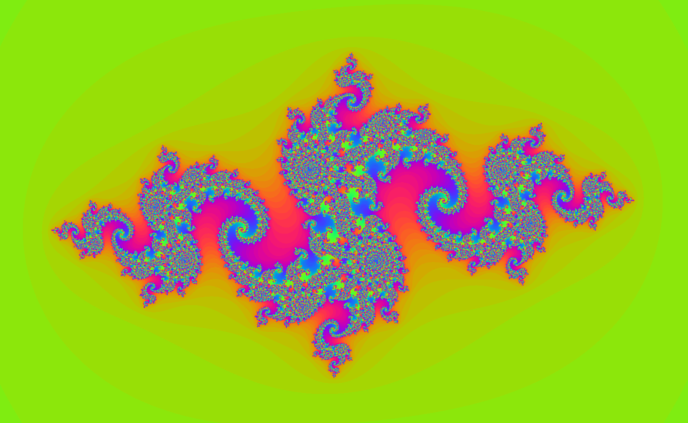

# Mandlebrot and Julia sets in Parallel
This project was inspired by [this](https://www.youtube.com/watch?v=PBvLs88hvJ8) great video. Some of the AVX code was taken from the corresponding [Github Repository](https://github.com/OneLoneCoder/olcPixelGameEngine/blob/master/Videos/OneLoneCoder_PGE_Mandelbrot.cpp).

The program displays the Mandelbrot / Julia set using [SFML](https://www.sfml-dev.org/) and speeds up the computation using OpenMP, as well as using AVX-256 instructions. It also has a CUDA version.


## Usage
Simply type `make` to compile. You might need to use `CXX=... make` to use a non standard compiler (as is necessary on mac to get OpenMP to work). If your CPU does not support AVX-256, then you might need to remove the `-DUSE_AVX` flag in the `makefile`.


You can alternatively use the other variants, by running the following compilation commands
```
make clean
TARGET=<TGT> make
```
Where `<TGT>` can be any of (some benchmark numbers are in the table. These are for 1024 iterations on the start screen):

| Name      | Description | FPS | Time |
|-----------|------------ | --- | ---- |
| NORMAL    | Standard, Naive Code                      | 1.02 | 0.844 |
| AVX       | AVX2 instructions                         | 3.12 | 0.18 |
| OMP       | Parallelise the code using OpenMP         | 2.5 | 0.34 |
| AVX_OMP   | Use both AVX and OpenMP                   | 7.0 | 0.08 |
| CUDA      | Use CUDA                                  | 6.5 | 0.05 |


Then to run the program, you can simply type `./bin/main I J`, where `I` is either 0 or 1, which will show the Mandelbrot or Julia set. `J` influences the colour scheme used, a colourful one when `J` is not given or 0, and black and white otherwise.
## Example



